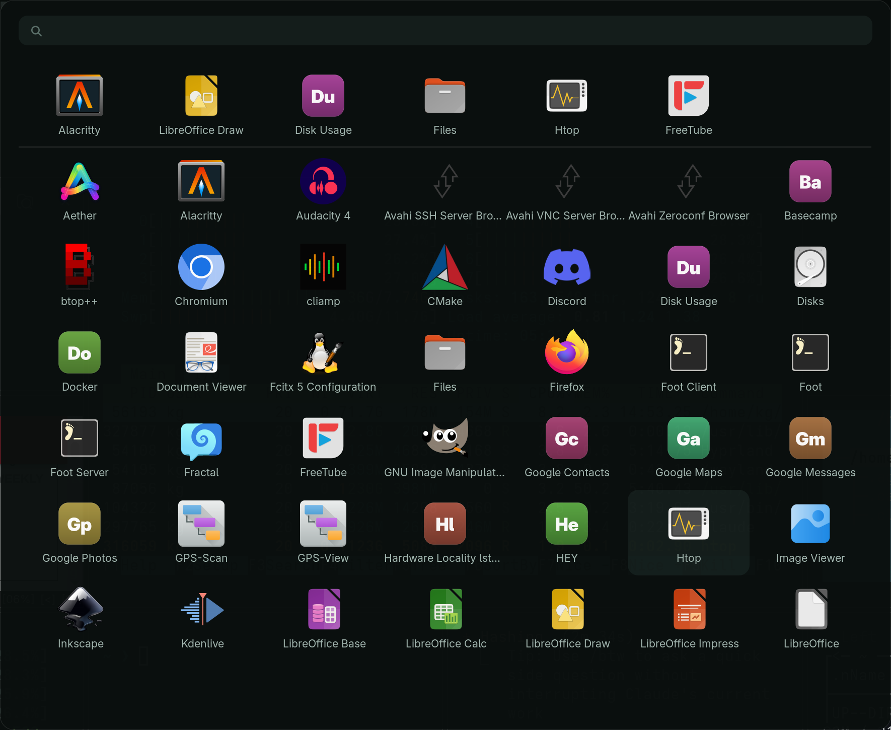

# Omarchy Rofi Launcher

Ein App-Launcher im Stil des macOS-Launchpads für [Omarchy](https://omarchy.org):
großes Icon-Raster, Suchfeld mit Lupe, schwebendes Fenster.



## Eigenschaften

- **7 × 7 Raster** mit 84-px-Icons und Beschriftung
- **Suchfeld** mit Lupensymbol, Titelzeile beim Start leer
- **Maus und Tastatur**: Hover markiert, Einfachklick startet; Pfeiltasten und Enter ebenso
- **Floating-Overlay**: zentriert, gepinnt, schließt bei App-Wahl oder `ESC`
- **Themenabhängig**: färbt sich beim Omarchy-Theme-Wechsel automatisch um
- **Platzhalter-Icons** für Webapps und TUIs ohne eigenes Icon

## Installation

Voraussetzung ist `rofi`:

```bash
omarchy-pkg-install rofi
```

Dann:

```bash
git clone https://github.com/KGasteier/omarchy-rofi-launcher.git
cd omarchy-rofi-launcher
./install.sh
```

**`SUPER + R`** öffnet den Launcher, ein zweiter Druck schließt ihn.

Entfernen: `./install.sh --uninstall`

## Was installiert wird

| Datei | Zweck |
|---|---|
| `~/.local/bin/omarchy-launch-rofi` | Starter mit Toggle |
| `~/.local/bin/omarchy-rofi-placeholder-icons` | Icon-Generator |
| `~/.config/hypr/rofi-launcher.lua` | Tastenbindung, Fensterregeln |
| `~/.config/omarchy/themed/applauncher.rasi.tpl` | Theme-Vorlage |
| `~/.config/rofi/applauncher.rasi` | statische Rückfallebene |
| `~/.local/share/icons/hicolor/scalable/apps/*.svg` | Platzhalter |

In `~/.config/hypr/hyprland.lua` wird ein Block zwischen Markern ergänzt und
beim Deinstallieren wieder entfernt; vorher entsteht eine Sicherung.

## Anpassen

Raster und Größen stehen in `~/.config/omarchy/themed/applauncher.rasi.tpl`:

```css
listview { columns: 7; lines: 7; }   /* Raster        */
element-icon { size: 84px; }         /* Icon-Kantenlänge */
window { width: 1770px; height: 1330px; }
```

Nach dem Ändern einmal das Theme neu setzen, damit die Vorlage greift:

```bash
omarchy-theme-set "$(< ~/.local/state/omarchy/current/theme.name)"
```

Wird die Zeilenzahl erhöht, muss `height` mitwachsen — `fixed-height` ist
aktiv, sonst schneidet das Fenster die letzte Reihe ab. Als Faustwert gilt
rund 158 px pro Reihe bei 84-px-Icons.

### Platzhalter-Icons

Neu installierte Webapps versorgen:

```bash
omarchy-rofi-placeholder-icons            # erzeugen
omarchy-rofi-placeholder-icons --dry-run  # nur anzeigen
omarchy-rofi-placeholder-icons --force    # vorhandene überschreiben
```

Die Kachelfarbe leitet sich aus einem SHA-256 des Icon-Namens ab: dieselbe App
behält ihre Farbe, die Palette streut über den Farbkreis. Erzeugte Dateien
tragen eine Markierung im SVG — echte Icons werden nie überschrieben, und
`--uninstall` löscht nur die eigenen.

## Bekannte Eigenheiten

**rofi läuft über XWayland.** Das Paket `extra/rofi` ist X11-basiert; eine
gepflegte Wayland-Abspaltung gibt es derzeit nicht in den Arch-Repos oder im
AUR. Unter Hyprland funktioniert es über XWayland — die Fensterregeln zielen
deshalb auf die Klasse `Rofi`.

**Die Lupe braucht eine Nerd-Schrift.** Das Symbol ist U+F002 aus dem
Nerd-Font-Bereich; `Adwaita Sans`, die Schrift der Beschriftungen, enthält
kein Lupenzeichen. `install.sh` warnt, falls keine passende Schrift vorhanden
ist. Abhilfe: `ttf-jetbrains-mono-nerd`.

**Fenstergröße bei wenigen Treffern.** Das Fenster behält seine Höhe, unten
bleibt Leerraum — so wie beim Vorbild. Wer lieber mitschrumpfende Fenster
mag, setzt `fixed-height: false`.

## Lizenz

MIT

## Autor

Klaus Gasteier
